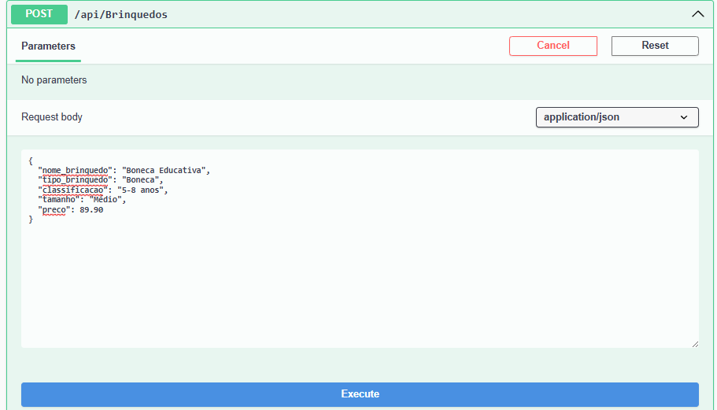

# CP1 .NET - 2TDSPS

Larissa Araújo Gama Alvarenga - RM96496

Luna Faustino Lima - RM552473

## Descrição

Este projeto implementa uma API completa para o sistema de gerenciamento de brinquedos para crianças até 12 anos. A API segue o padrão REST e implementa todas as operações CRUD (Create, Read, Update, Delete) utilizando o Entity Framework Core para persistência de dados em um banco Oracle.

## Configuração e Execução

### Passos para Configuração

1. Clone este repositório:
   ```bash
   git clone https://github.com/LunaFaustino/.net-CP1-2025.git
   cd BrinquedosAPI
   ```

2. Abra a solução `BrinquedosAPI.sln` no Visual Studio 2022

3. Configure a string de conexão do banco de dados no arquivo `appsettings.json`:
   ```json
   "ConnectionStrings": {
     "DefaultConnection": "User Id=seu_usuario;Password=sua_senha;Data Source=localhost:1521/xepdb1;"
   }
   ```

4. Execute as migrations para criar a estrutura do banco de dados:
   ```
   Add-Migration InitialCreate
   Update-Database
   ```

5. Execute o projeto e o Swagger será aberto automaticamente

## Demonstração dos Endpoints

### GET - /api/Brinquedos - Listando todos os brinquedos


### GET - /api/Brinquedos/{id} - Buscando um brinquedo específico pelo ID


### POST - /api/Brinquedos - Criando um novo brinquedo




Exemplo de JSON utilizado:
```json
{
  "nome_brinquedo": "Boneca Educativa",
  "tipo_brinquedo": "Boneca",
  "classificacao": "5-8 anos",
  "tamanho": "Médio",
  "preco": 89.90
}
```

### PUT - /api/Brinquedos/{id} - Atualizando um brinquedo existente


Exemplo de JSON utilizado:
```json
{
  "id_brinquedo": 3,
  "nome_brinquedo": "Boneca Educativa Atualizada",
  "tipo_brinquedo": "Boneca",
  "classificacao": "5-8 anos",
  "tamanho": "Médio",
  "preco": 99.90
}
```

### DELETE - /api/Brinquedos/{id} - Removendo um brinquedo


